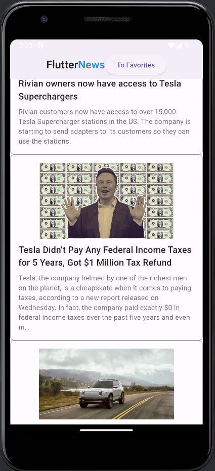

# Flutter news app

Second homework of Flutter MIPT course

## Features

- Screen with news list
- Screen to open news with link to web
- Cross platform
New features:
- Screen with your favourite news
- Clean architecture of code
## Installation

git clone

change .env file with your api_key:

api_key=your_api_key_from_news_api
    
## Screenshots

